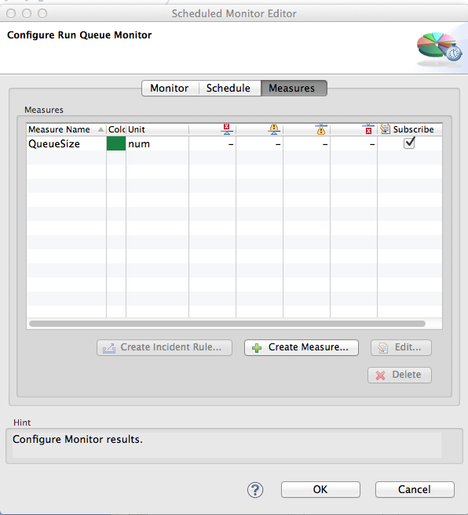
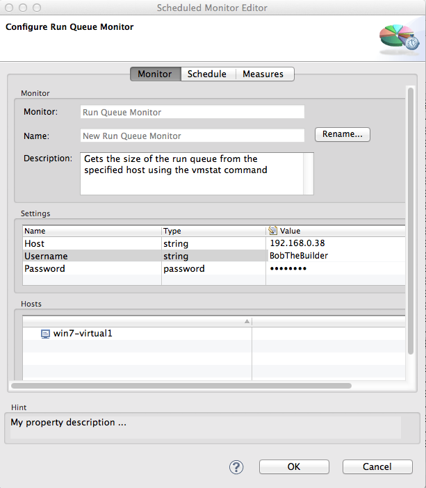
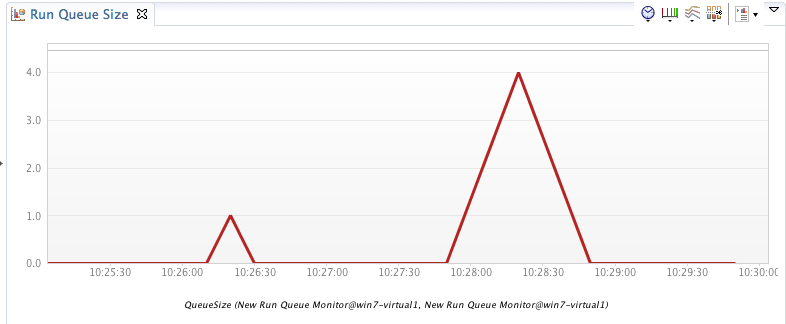
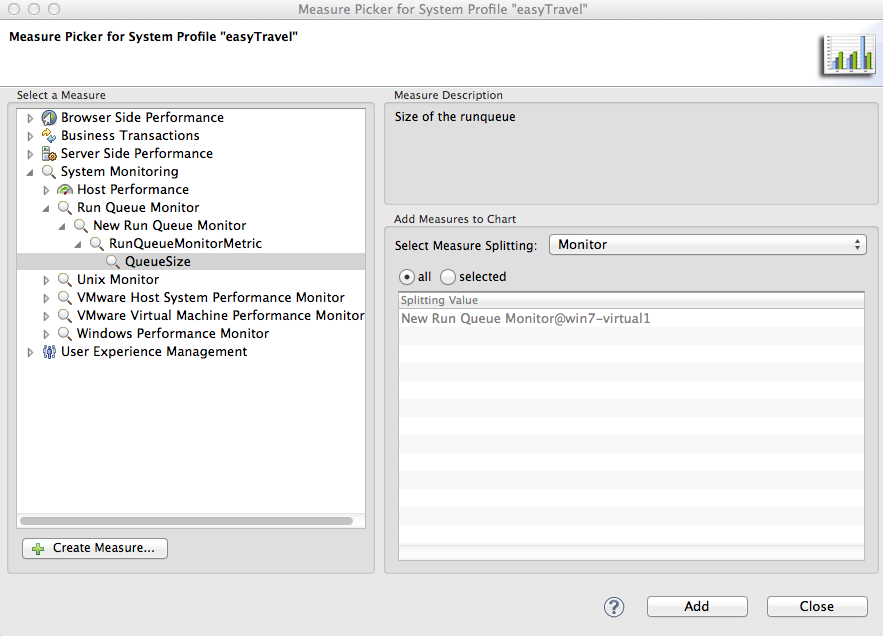

<html xmlns="http://www.w3.org/1999/xhtml">
<head>
    <title>RunQueue Monitor Plugin</title>
    <meta http-equiv="Content-Type" content="text/html; charset=UTF-8"/>
    <meta http-equiv="X-UA-Compatible" content="IE=EmulateIE8" />
    <meta content="Scroll Wiki Publisher" name="generator"/>
    <link type="text/css" rel="stylesheet" href="css/blueprint/liquid.css" media="screen, projection"/>
    <link type="text/css" rel="stylesheet" href="css/blueprint/print.css" media="print"/>
    <link type="text/css" rel="stylesheet" href="css/content-style.css" media="screen, projection, print"/>
    <link type="text/css" rel="stylesheet" href="css/screen.css" media="screen, projection"/>
    <link type="text/css" rel="stylesheet" href="css/print.css" media="print"/>
</head>
<body>
                <h1>RunQueue Monitor Plugin</h1>
    

        <h2>Overview</h2>
    

    

    

This plugin retrieves the size of the Run Queue from the specified host(s).    

    

    

        <h2>Plugin Details</h2>
    

        <table>
<thead class=" "></thead><tfoot class=" "></tfoot><tbody class=" ">    <tr>
            <td rowspan="1" colspan="1">
        

Plug-In Files    

            </td>
                <td rowspan="1" colspan="1">
        

<a href="attachments_149554261_1_com.compuware.plugins.runqueuemonitor_1.0.2.jar">com.compuware.plugins.runqueuemonitor_1.0.2.jar</a>    

            </td>
        </tr>
    <tr>
            <td rowspan="1" colspan="1">
        

Author    

            </td>
                <td rowspan="1" colspan="1">
        

Joe Hoffman    

            </td>
        </tr>
    <tr>
            <td rowspan="1" colspan="1">
        

dynaTrace Versions    

            </td>
                <td rowspan="1" colspan="1">
        

5.5+    

            </td>
        </tr>
    <tr>
            <td rowspan="1" colspan="1">
        

License    

            </td>
                <td rowspan="1" colspan="1">
        

<a href="attachments_5275722_2_dynaTraceBSD.txt">dynaTrace BSD</a>    

            </td>
        </tr>
    <tr>
            <td rowspan="1" colspan="1">
        

Support    

            </td>
                <td rowspan="1" colspan="1">
        

<a href="https://community/display/DL/Support+Levels">Not Supported</a>    

            </td>
        </tr>
    <tr>
            <td rowspan="1" colspan="1">
        

Release History    

            </td>
                <td rowspan="1" colspan="1">
        

Dec 19, 2013. v1.0.2 - Initial Release    

    

    

            </td>
        </tr>
</tbody>        </table>
            

    

    

        <h2>Provided Measures</h2>
    

        <table>
<thead class=" ">    <tr>
            <td rowspan="1" colspan="1">
        

Measure    

            </td>
                <td rowspan="1" colspan="1">
        

Description    

            </td>
        </tr>
</thead><tfoot class=" "></tfoot><tbody class=" ">    <tr>
            <td rowspan="1" colspan="1">
        

QueueSize    

            </td>
                <td rowspan="1" colspan="1">
        

Integer value representing the runqueue size at the moment of execution of the plugin    

            </td>
        </tr>
</tbody>        </table>
            

    

    

        <h2>Screenshot of the measures screen</h2>
    

            
            

    

    

        <h2>Configuration</h2>
    

The following properties need to be defined when setting up this monitor    

    

        <table>
<thead class=" "></thead><tfoot class=" "></tfoot><tbody class=" ">    <tr>
            <td rowspan="1" colspan="1">
        

<strong class=" ">Property Name</strong>    

            </td>
                <td rowspan="1" colspan="1">
        

<strong class=" ">Type</strong>    

            </td>
                <td rowspan="1" colspan="1">
        

<strong class=" ">Default Value</strong>    

            </td>
                <td rowspan="1" colspan="1">
        

<strong class=" ">Notes</strong>    

            </td>
        </tr>
    <tr>
            <td rowspan="1" colspan="1">
        

Host    

            </td>
                <td rowspan="1" colspan="1">
        

String    

            </td>
                <td rowspan="1" colspan="1">
        

localhost    

            </td>
                <td rowspan="1" colspan="1">
        

hostname or IP address    

            </td>
        </tr>
    <tr>
            <td rowspan="1" colspan="1">
        

Username    

            </td>
                <td rowspan="1" colspan="1">
        

String    

            </td>
                <td rowspan="1" colspan="1">
        

    

            </td>
                <td rowspan="1" colspan="1">
        

Username to be used to authenticate into the specified host where the Runqueue query is to be performed.    

            </td>
        </tr>
    <tr>
            <td rowspan="1" colspan="1">
        

Password    

            </td>
                <td rowspan="1" colspan="1">
        

String    

            </td>
                <td rowspan="1" colspan="1">
        

    

            </td>
                <td rowspan="1" colspan="1">
        

Password to be used to authenticate into the specified host where the RunQueue query is to be performed    

            </td>
        </tr>
</tbody>        </table>
            

    

    

        <h2>Screenshot of the Configuration page</h2>
    

            
            

    

    

        <h2>Usage Example</h2>
    

This plugin can be useful for tracking the runqueue size as well as by using dynaTrace Alerting, be proactively notified when the RunQueue exceeds a desired threshold.  Simply add this measure to a chart and observe the value over time.    

    

            
                 
            

    

    

        <h2>Installation</h2>
    

Import the Plugin into the dynaTrace Server via the dynaTrace Server Settings menu -&gt; Plugins -&gt; Install Plugin. For details how to do this please refer to the dynaTrace documentation:    

    

<a href="https://community/display/DOCDT55/Plugin+Management">Plugin Management</a>    

    

            

        

        

        

    

</body>
</html>
